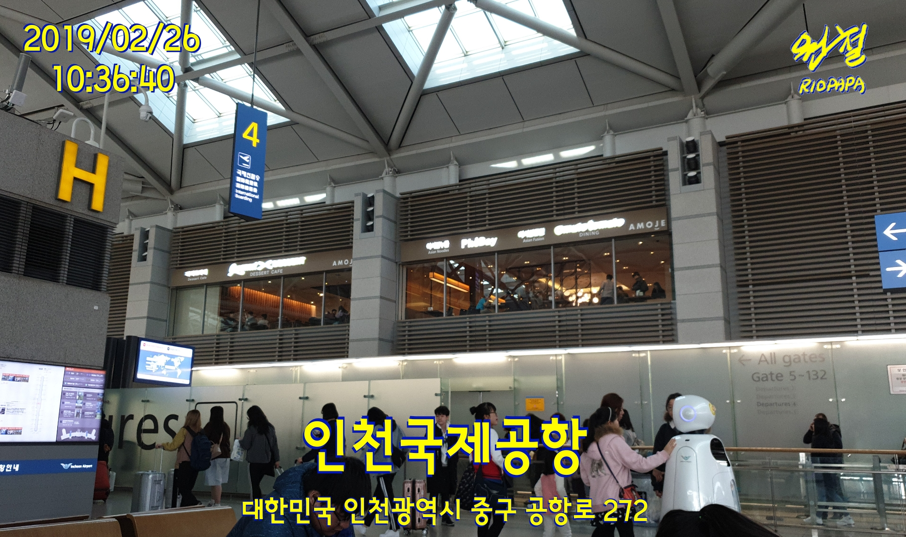
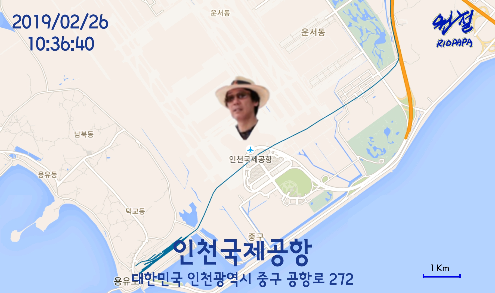

# PhoVo Memo (Photo Voice Memo)

With this application, you can keep some memo, place and address in photo. It may be useful to record food name, taste.. in some restaurant.   

It saves two photo, one is photo you shoted and the other is adding memo you spoke, place name, and address, so that you may refer later.

Information in screen shots are
- google map place and address (you may change after gathering from google 
- screen shot date and time (local time)
- some memo spoken by you just before taking photo

This application is for those who travels around the world and wants to record where he/she was. By capturing you can review photo with screen shot in time sequenced between photos.

## Permission Required

``
    <uses-permission android:name="android.permission.WRITE_EXTERNAL_STORAGE" />
    <uses-permission android:name="android.permission.INTERNET" />
    <uses-permission android:name="android.permission.RECORD_AUDIO" />
    <uses-permission android:name="com.google.android.providers.gsf.permission.READ_GSERVICES" />
    <uses-permission android:name="android.permission.ACCESS_NETWORK_STATE" />
    <uses-permission android:name="android.permission.ACCESS_FINE_LOCATION" />
    <uses-feature android:name="android.hardware.camera" />
    <uses-permission android:name="android.permission.CAMERA" />
    <uses-permission android:name="android.permission.MODIFY_AUDIO_SETTINGS"/>
``

These permission should be applied by yourself thru android setting.

## Source in github

Application source can be downloaded from [my github][1].

[1]: https://github.com/riopapa/PhovoMemo

## Screenshots

- main activity (activity_main.xml) 

 &nbsp;&nbsp;&nbsp;&nbsp;&nbsp;&nbsp;&nbsp;&nbsp;&nbsp;&nbsp;&nbsp;&nbsp;

- camera activity (activity_camera.xml) 
Photo shot with location information File name in DCIM has place name also 
 &nbsp;&nbsp;&nbsp;&nbsp;&nbsp;&nbsp;&nbsp;&nbsp;&nbsp;&nbsp;&nbsp;&nbsp; 

- google map activity (activity_land.xml) 
Google Map shot with location information File name in DCIM has place name also
 &nbsp;&nbsp;&nbsp;&nbsp;&nbsp;&nbsp;&nbsp;&nbsp;&nbsp;&nbsp;&nbsp;&nbsp; 

## How to use

1. Run this program, and it shows google map and nearby place list, so select exact place name.

2. Google voice detecting will be automatically prompted until you turn it off with  You turn it on by pressing  

3. ##SHOT## button will save photo and photo with info and will stay for next shot, ##SHOT & EXIT## will save photos and exit application.

## Comments

- Android SDK API 26 or above 
- Google SST language setting is not included, you can set it via google setting

